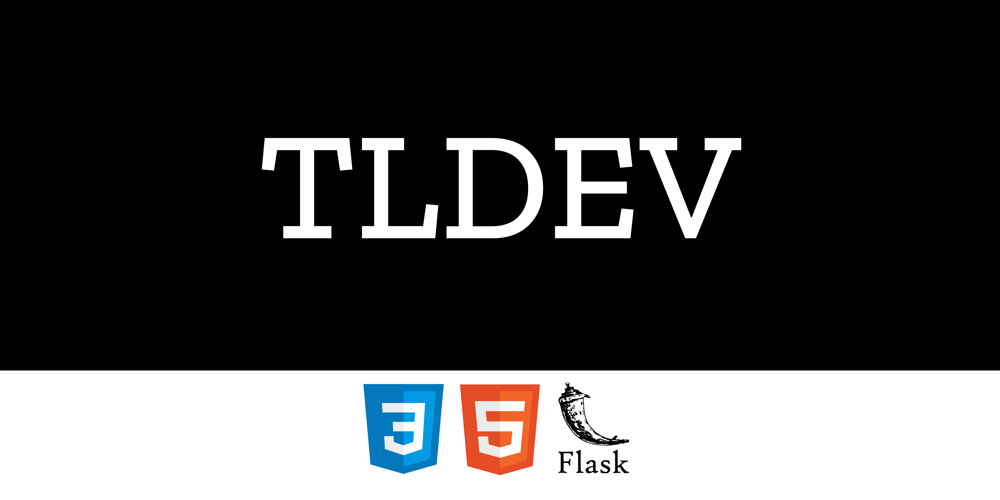

<h1 align="center"> TLDEV </h1>
<p align="center"> Este código pode ser terrível e cheio de erros, mas foi feito com carinho </p>
<p align="center">🚀 Em construção... 🚧</p>
<p align="center">  <a href="#objetivo">Objetivo</a> •  <a href="#tecnologias">Tecnologias</a> • <a href="#pré-requisitos">Como rodar ?</a></p>


## Como rodar ?
```
$ git https://github.com/TLDEV-BR/TLDEV-SITE.git
$ cd TLDEV-SITE
$ virtualenv venv
$ source venv/bin/activate
$ pip install requirements.txt
$ flask app.py
```
